# 🎂 WhatsApp Birthday Bot - Enterprise Edition

[](https://opensource.org/licenses/MIT)
[](https://docs.docker.com/compose/)
[](https://www.python.org/)
[](https://nodejs.org/)
[](https://prometheus.io/)

> **Automated WhatsApp birthday reminder system with enterprise-grade monitoring, observability, and disaster recovery capabilities.**

Never forget a birthday again! This fully automated system sends personalized WhatsApp messages to designated groups on birthdays, with complete monitoring, logging, and backup infrastructure.

---

## 📋 Table of Contents

- [Features](#-features)
- [Architecture](#-architecture)
- [Quick Start](#-quick-start)
- [Data Flow](#-data-flow)
- [Technology Stack](#-technology-stack)
- [System Components](#-system-components)
- [Monitoring & Observability](#-monitoring--observability)
- [Service Manager](#-service-manager)
- [Backup & Disaster Recovery](#-backup--disaster-recovery)
- [API Documentation](#-api-documentation)
- [Configuration](#-configuration)
- [Troubleshooting](#-troubleshooting)

---

## ✨ Features

### Core Functionality
- 🎂 **Automated Birthday Reminders** - Daily checks at 8:00 AM
- 📱 **WhatsApp Integration** - Send messages via wppconnect
- 🌐 **Web Dashboard** - React-based UI for management
- 🔄 **RESTful API** - Complete CRUD operations
- 📊 **Multiple Group Support** - Different messages per group
- 🎨 **Fun Facts** - Random fun facts when no birthdays

### Enterprise Features
- 📈 **Complete Monitoring Stack** - Prometheus + Grafana (7 services)
- 🚨 **Alerting System** - Real-time alerts via Slack
- 💾 **Automated Backups** - Daily backups with 90-day retention
- 🔄 **Disaster Recovery** - Complete system restore capability
- 📊 **Observability** - Metrics, logs, and traces
- 🎯 **Health Checks** - Automated service monitoring
- 🐳 **Container Orchestration** - Docker Compose with 12 services
- 🔐 **Security** - Environment-based secrets management

---

## 🏗️ Architecture

### System Architecture
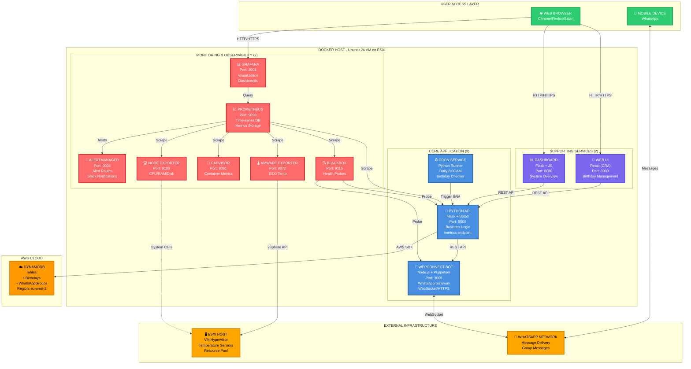

### Architecture Summary

**12 Services Total:**
- 🔴 **Monitoring & Observability:** 7 services
- 🔵 **Core Application:** 3 services  
- 🟣 **Supporting Services:** 2 services

**External Dependencies:**
- 🟠 **AWS DynamoDB** - Data storage
- 🟠 **ESXi Host** - VM infrastructure
- 🟠 **WhatsApp Network** - Message delivery

---

## 🔄 Data Flow

### Daily Birthday Check Process
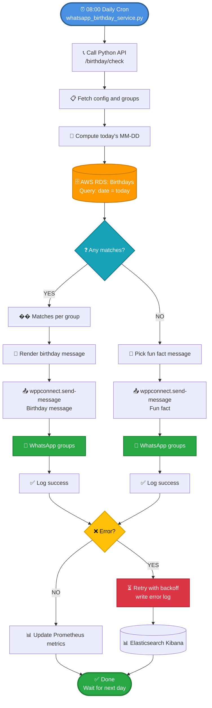

### Message Delivery Sequence
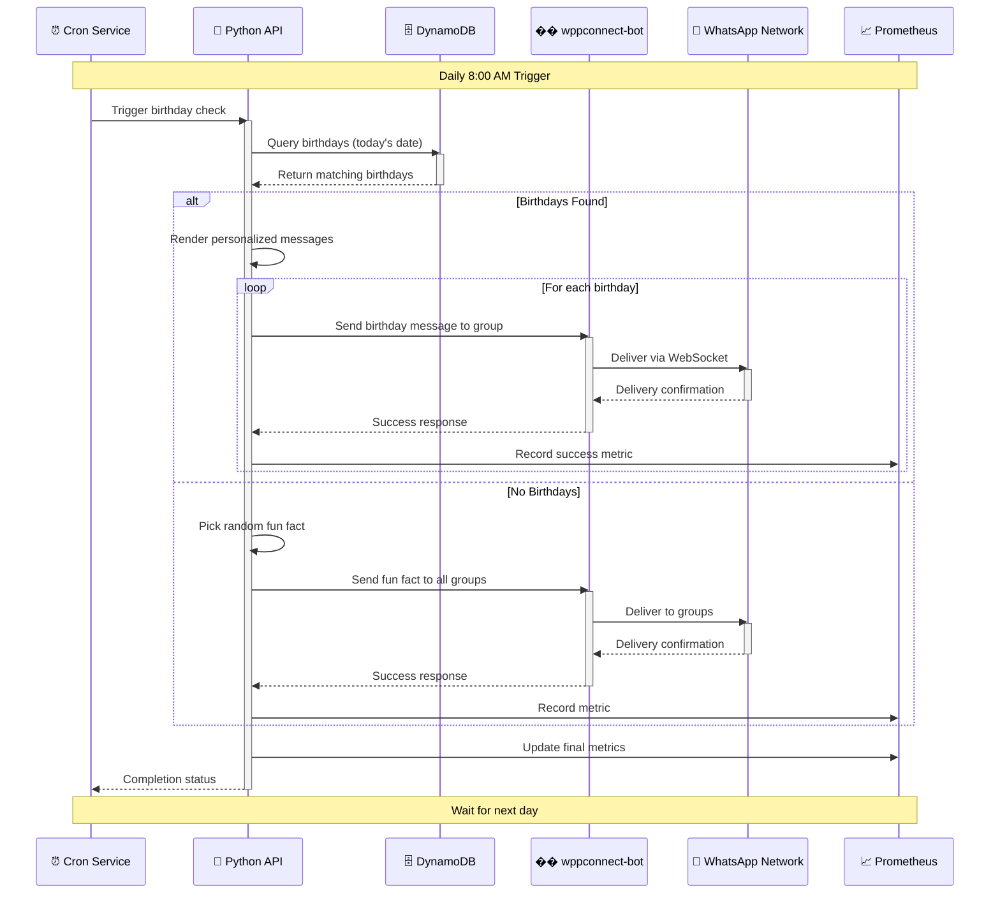

---

## 🚀 Quick Start

### 1. Clone Repository
```bash
git clone https://github.com/adeolu-rabiu/whatsapp-birthday-lambda.git
cd whatsapp-birthday-lambda
```

### 2. Configure Environment
```bash
# Copy example environment file
cp .env.example .env

# Edit with your credentials
nano .env
```

Required variables:
```env
# AWS Configuration
AWS_ACCESS_KEY_ID=your_aws_key
AWS_SECRET_ACCESS_KEY=your_aws_secret
AWS_REGION=eu-west-2
DYNAMODB_TABLE_NAME=Birthdays
WHATSAPP_GROUPS_TABLE=WhatsAppGroups

# API Configuration
AUTH_TOKEN=your_secure_token

# Monitoring
GRAFANA_ADMIN_USER=admin
GRAFANA_ADMIN_PASS=agzo

# ESXi Monitoring (Optional)
VSPHERE_HOST=192.168.1.2
VSPHERE_USER=root
VSPHERE_PASSWORD=your_esxi_password
```

### 3. Start Services
```bash
# Using Service Manager (Recommended)
chmod +x service_manager.v6
./service_manager.v6
# Choose option 1: Start All Services

# Or using Docker Compose directly
docker-compose up -d
```

### 4. Connect WhatsApp
```bash
# Via Service Manager
./service_manager.v6
# Choose option 6: Manage WhatsApp Connection
# Choose option 4: Show QR Code

# Direct URL
# Visit: http://192.168.1.66:3005/qr-code.png
# Scan with WhatsApp: Settings → Linked Devices → Link a Device
```

### 5. Access Applications

| Service | URL | Credentials |
|---------|-----|-------------|
| 🌐 Web UI | http://192.168.1.66:3000 | - |
| 📊 Dashboard | http://192.168.1.66:8080 | - |
| 💼 API | http://192.168.1.66:5000 | - |
| 📈 Grafana | http://192.168.1.66:3001 | admin / agzo |
| 🔍 Prometheus | http://192.168.1.66:9090 | - |
| 💬 WhatsApp Bot | http://192.168.1.66:3005 | - |

---

## 💻 Technology Stack
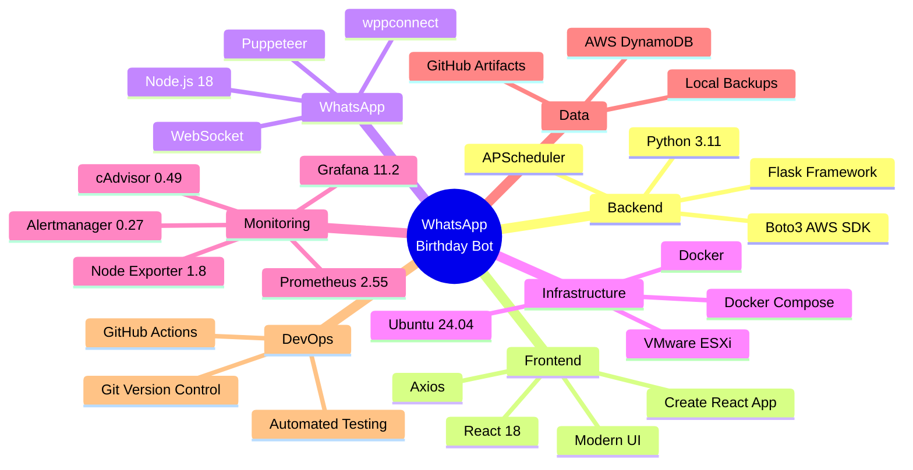

### Component Versions

| Component | Version | Purpose |
|-----------|---------|---------|
| Python | 3.11 | Backend API & Logic |
| Node.js | 18 | WhatsApp Bot |
| React | 18 | Frontend UI |
| Flask | 2.3+ | Web Framework |
| Prometheus | 2.55 | Metrics Collection |
| Grafana | 11.2 | Visualization |
| Docker | 24+ | Containerization |
| Ubuntu | 24.04 | Host OS |

---

## 🎯 System Components

### Service Overview
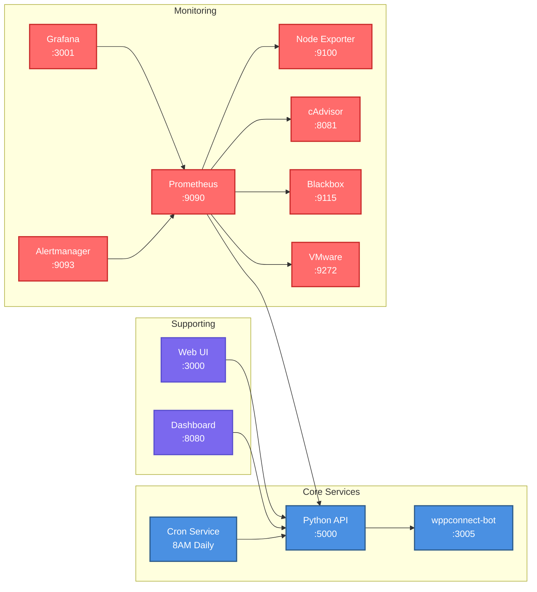

### Port Allocation
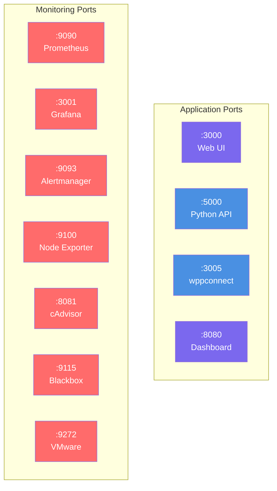

---

## 📊 Monitoring & Observability

### Monitoring Architecture
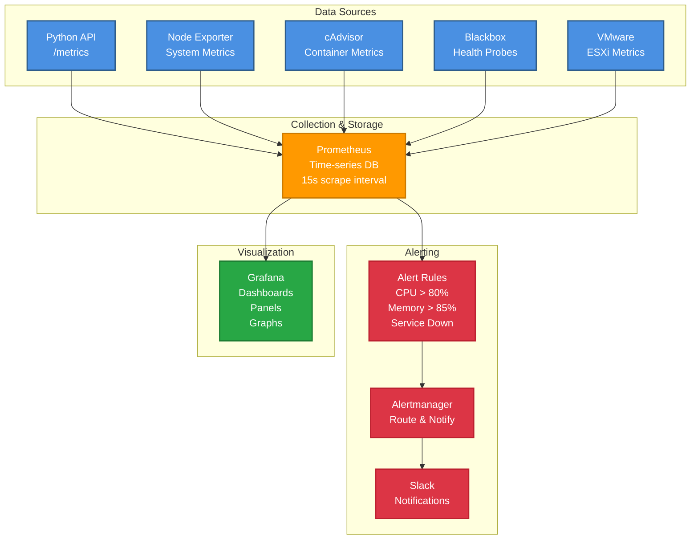

### Available Metrics
```promql
# Application Metrics
whatsapp_messages_sent_total{group="Family",message_type="birthday"} 42
whatsapp_messages_failed_total{group="Friends",reason="timeout"} 2
birthday_bot_daily_check_status 1
birthdays_found_today 3
whatsapp_connection_status 1

# System Metrics
node_cpu_seconds_total{mode="idle"} 98.5
node_memory_MemAvailable_bytes 4294967296
node_filesystem_avail_bytes{mountpoint="/"} 10737418240
node_load1 0.5

# Container Metrics
container_cpu_usage_seconds_total{name="python-api"} 0.25
container_memory_usage_bytes{name="wppconnect-bot"} 524288000

# ESXi Metrics
vmware_host_sensor_temperature_celsius{sensor="CPU0"} 45
vmware_host_cpu_usage 35
vmware_host_memory_usage 60
```

### Grafana Dashboards

**Pre-configured:**
1. **Birthday Bot Overview** - Application metrics
2. **System Resources** - VM performance
3. **Container Metrics** (ID: 193) - Docker stats
4. **ESXi Monitoring** - Host metrics

**Import Additional:**
- Dashboard 1860: Node Exporter Full
- Dashboard 14282: cAdvisor Details

---

## 🎮 Service Manager

**Version 6.0** - Complete Stack Control
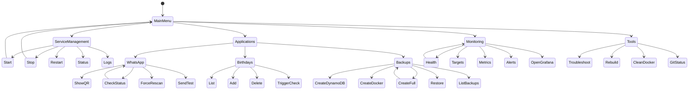

### Launch
```bash
./service_manager.v6
```

### Main Features

**Service Management:**
- ✅ Start/Stop/Restart all services
- ✅ Check service status
- ✅ View logs (all or specific)
- ✅ Restart single service

**WhatsApp Management:**
- ✅ Check connection status
- ✅ Display all groups
- ✅ Send test messages
- ✅ Show QR code
- ✅ **Force new QR code (rescan)**
- ✅ Restart connection

**Backup & Restore:**
- ✅ Complete backups (DynamoDB + Docker)
- ✅ DynamoDB only backups
- ✅ Docker images only
- ✅ List all backups
- ✅ Restore from any backup
- ✅ Setup automatic daily backups

**Monitoring:**
- ✅ Stack health check
- ✅ View Prometheus targets
- ✅ View real-time metrics
- ✅ Check active alerts
- ✅ Quick access to Grafana
- ✅ System resource usage

---

## 💾 Backup & Disaster Recovery

### Backup Strategy
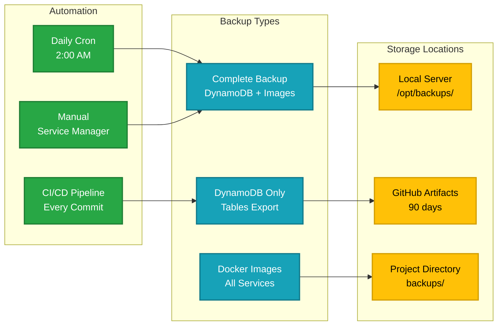

### Recovery Process
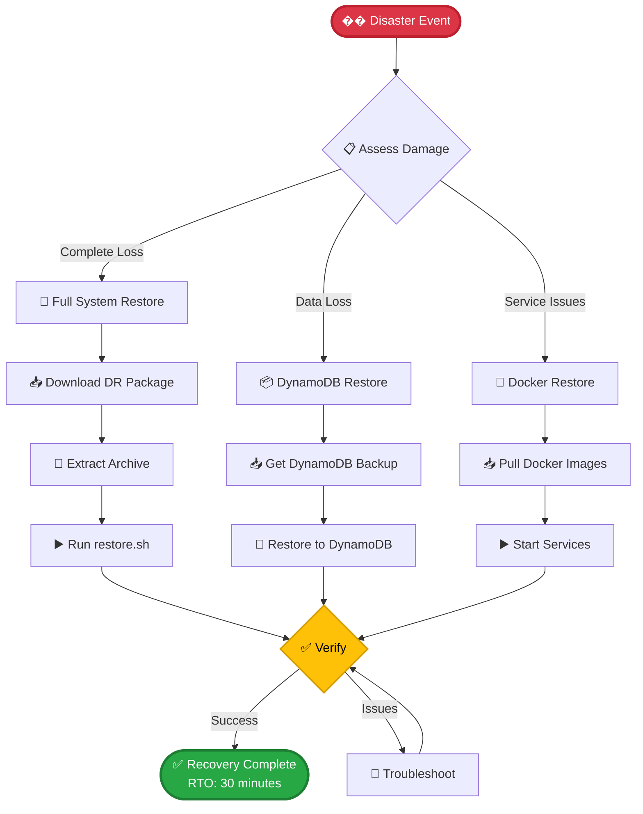

**RTO (Recovery Time Objective):** 30 minutes  
**RPO (Recovery Point Objective):** Last backup (< 24 hours)

---

## 📡 API Documentation

### Base URL
```
http://192.168.1.66:5000
```

### Endpoints Overview
```mermaid
graph LR
    Client[API Client] --> Health[/health<br/>GET]
    Client --> Birthdays[/birthdays<br/>GET/POST/DELETE]
    Client --> Trigger[/send-birthday-messages<br/>POST]
    Client --> Metrics[/metrics<br/>GET]
    
    Health --> Status[Health Status]
    Birthdays --> CRUD[CRUD Operations]
    Trigger --> Manual[Manual Check]
    Metrics --> Prom[Prometheus Format]
    
    classDef endpoint fill:#4a90e2,stroke:#2e5c8a,stroke-width:2px,color:#fff
    classDef response fill:#28a745,stroke:#1e7e34,stroke-width:2px,color:#fff
    
    class Health,Birthdays,Trigger,Metrics endpoint
    class Status,CRUD,Manual,Prom response
```

### Example Requests

#### Health Check
```bash
GET /health

# Response
{
  "status": "healthy",
  "timestamp": "2024-10-30T12:00:00Z",
  "services": {
    "dynamodb": "connected",
    "whatsapp": "connected"
  }
}
```

#### List Birthdays
```bash
GET /birthdays

# Response
[
  {
    "id": "uuid",
    "name": "John Doe",
    "date": "1990-10-30",
    "group": "Family"
  }
]
```

#### Add Birthday
```bash
POST /birthdays
Content-Type: application/json

{
  "name": "Jane Smith",
  "date": "1995-05-15",
  "group": "Friends"
}
```

---

## 🔧 Troubleshooting

### Common Issues
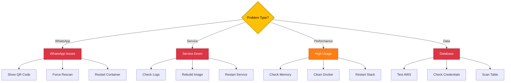

### Quick Fixes

**WhatsApp Not Connected:**
```bash
./service_manager.v6
# Option 6 → Option 5: Force New QR Code
```

**Service Down:**
```bash
docker-compose logs <service-name>
docker-compose restart <service-name>
```

**High Memory:**
```bash
docker stats
docker system prune -af
docker-compose restart
```

---

## 🤝 Contributing

Contributions welcome! Please follow our guidelines:
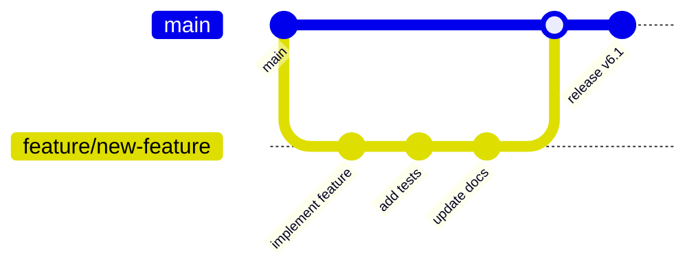

---

## 📄 License

MIT License - see [LICENSE](LICENSE) file

---

## 🙏 Acknowledgments

- [wppconnect-team](https://github.com/wppconnect-team) - WhatsApp Web API
- [Prometheus](https://prometheus.io/) - Monitoring
- [Grafana Labs](https://grafana.com/) - Visualization
- AWS DynamoDB - Data storage

---

## 📞 Support

- 🐛 **Issues:** [GitHub Issues](https://github.com/adeolu-rabiu/whatsapp-birthday-lambda/issues)
- 💬 **Discussions:** [GitHub Discussions](https://github.com/adeolu-rabiu/whatsapp-birthday-lambda/discussions)
- 📚 **Docs:** [Wiki](https://github.com/adeolu-rabiu/whatsapp-birthday-lambda/wiki)

---

<div align="center">

**⭐ Star this repository if you find it helpful!**

**Made with ❤️ by [Adeolu Rabiu](https://github.com/adeolu-rabiu)**

</div>
